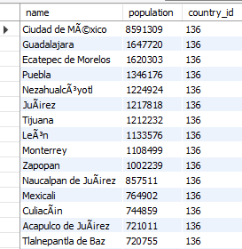
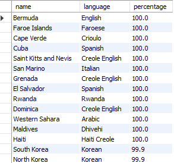
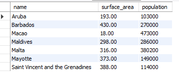
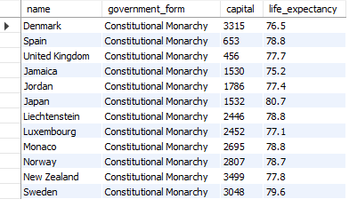
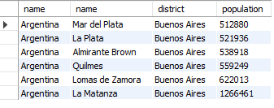
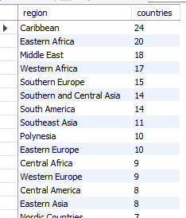

# MySQL Countries
1. What query would you run to get all the countries
that speak Slovene? Your query should return
the name of the country, language and language
percentage. Your query should arrange the result
by language percentage in descending order.
    ```
    select countries.name, languages.language,languages.percentage 
    from languages join countries 
    where language='slovene' and countries.code = languages.country_code 
    order by languages.percentage DESC
    ```
    

2. What query would you run to display the total
number of cities for each country? Your query
should return the name of the country and the
total number of cities. Your query should arrange
the result by the number of cities in descending
order.
    ```
    SELECT countries.name, COUNT( cities.name) as `cities` FROM countries 
    join cities WHERE cities.country_code=countries.code 
    GROUP BY countries.name ORDER BY COUNT( cities.name) DESC;
    ```
    

3. What query would you run to get all the cities in
Mexico with a population of greater than
500,000? Your query should arrange the result
by population in descending order.
```
SELECT cities.name, cities.population, cities.country_id FROM cities 
WHERE cities.country_code='MEX' AND cities.population>500000 
ORDER BY cities.population DESC;
```


4. What query would you run to get all languages ineach country with a percentage greater than89%? Your query should arrange the result by percentage in descending order
    ```
    SELECT countries.name,languages.language, languages.percentage FROM countries
    join languages WHERE languages.percentage>89
    and languages.country_code=countries.code  
    ORDER BY languages.percentage DESC;
    ```
    


5. What query would you run to get all the countries
with Surface Area below 501 and Population
greater than 100,000?

    ```
    SELECT name, surface_area, countries.population FROM countries 
    WHERE surface_area<501 and population>100000;
    ```
    

6. What query would you run to get countries with
only Constitutional Monarchy with a capital
greater than 200 and a life expectancy greater
than 75 years?
    ```
    SELECT name, government_form,capital,life_expectancy  FROM countries
    WHERE capital>200 and life_expectancy>75 and government_form='Constitutional Monarchy' ;
    ```
    


7. What query would you run to get all the cities of
Argentina inside the Buenos Aires district and
have the population greater than 500, 000? The
query should return the Country Name, City
Name, District and Population
    ```
    SELECT countries.name,cities.name,cities.district,cities.population 
    FROM countries join cities 
    WHERE cities.country_code=countries.code and cities.district='Buenos Aires' 
    and cities.population>500000;
    ```
    

8. What query would you run to summarize the
number of countries in each region? The query
should display the name of the region and the
number of countries. Also, the query should
arrange the result by the number of countries in
descending order
    ```
    SELECT countries.region, count( countries.region) as 'countries' FROM  countries GROUP BY countries.region ORDER BY count(countries.region) DESC;
    ```
    